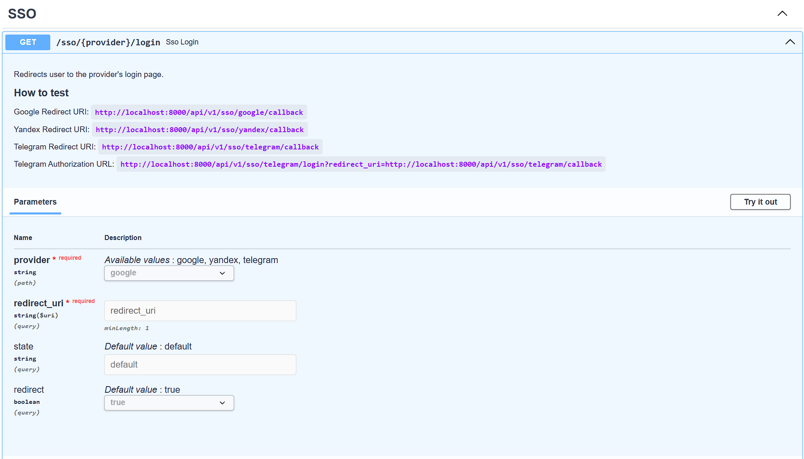
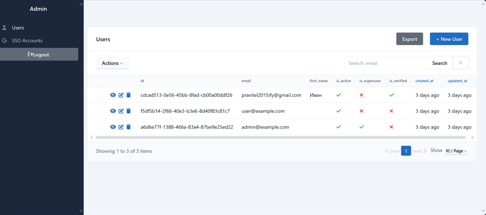
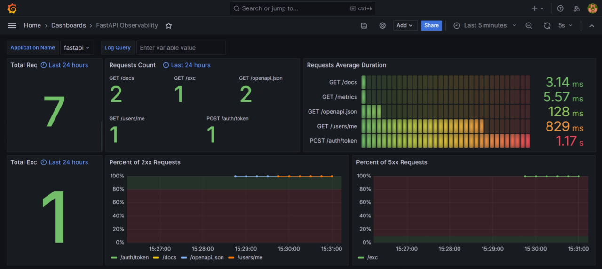
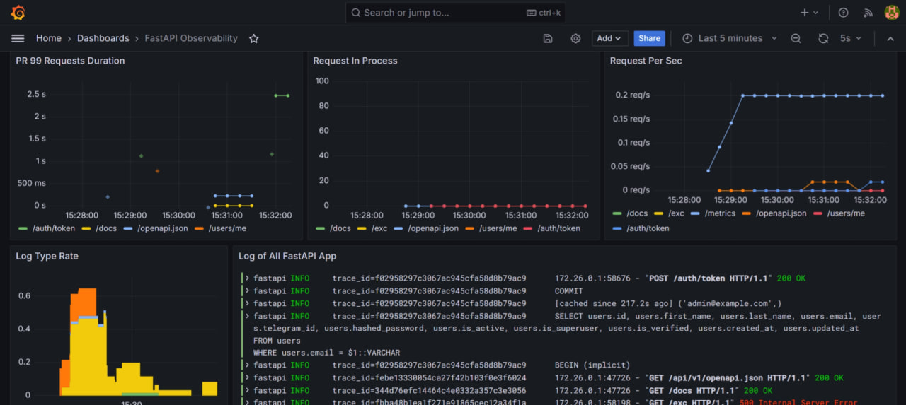

# FastAPI Auth

Authorization server with **Google**, **Yandex** & **Telegram SSO**, **RBAC**, **user management**, etc.
Powered by FastAPI & PostgreSQL.

## Features

- Secure and usable **JWT authorization** (feat. Refresh Tokens)
- Extendable **single sign-on** via Google, Yandex & Telegram
- Confirm actions using a **one-time code** (Email & Telegram)
- Extendable **role-based access control** (supports user & superuser)
- Powerful **user** management: CRUD, search, etc.
- **Admin panel** with authorization & CRUD operations
- **Observability** with Grafana: metrics, tracing & logging

## Installation

1. Clone the repository:

```bash
git clone https://github.com/everysoftware/fastapi-auth
```

2. Generate RSA keys:

```bash
openssl genrsa -out certs/private.pem 2048
openssl rsa -in certs/private.pem -pubout -out certs/public.pem
```

3. Create a `.env` file. Use the `.env.example` as a reference.
4. Run the application:

```bash
make up
```

## Screenshots

### Swagger UI




### Admin Panel



### Dashboards




**Made with love by Ivan Stasevich ❤️**
