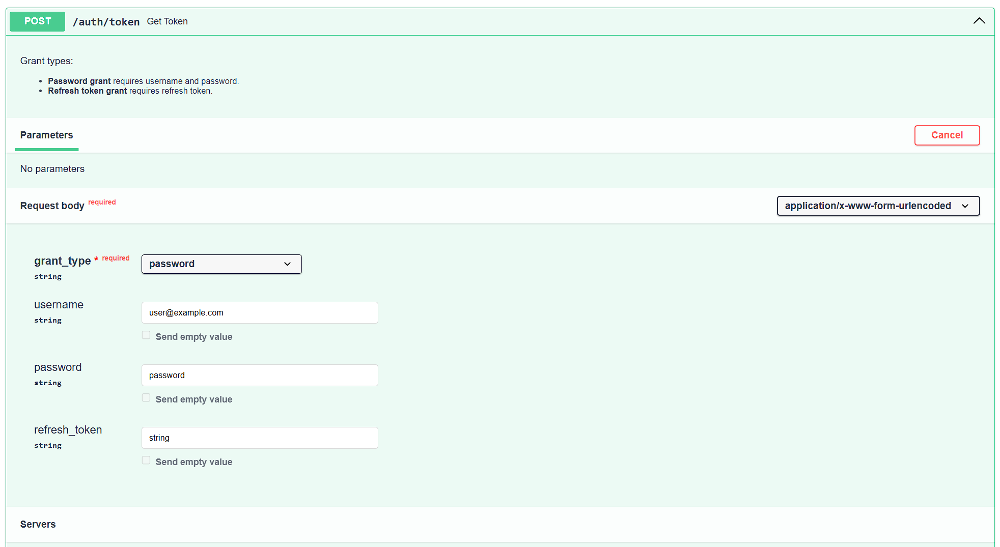
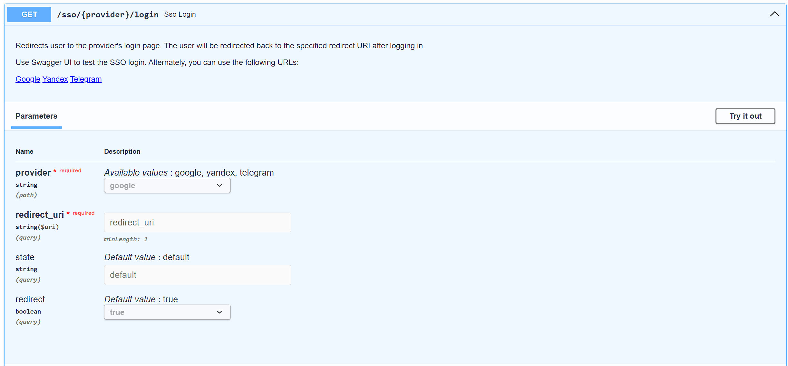
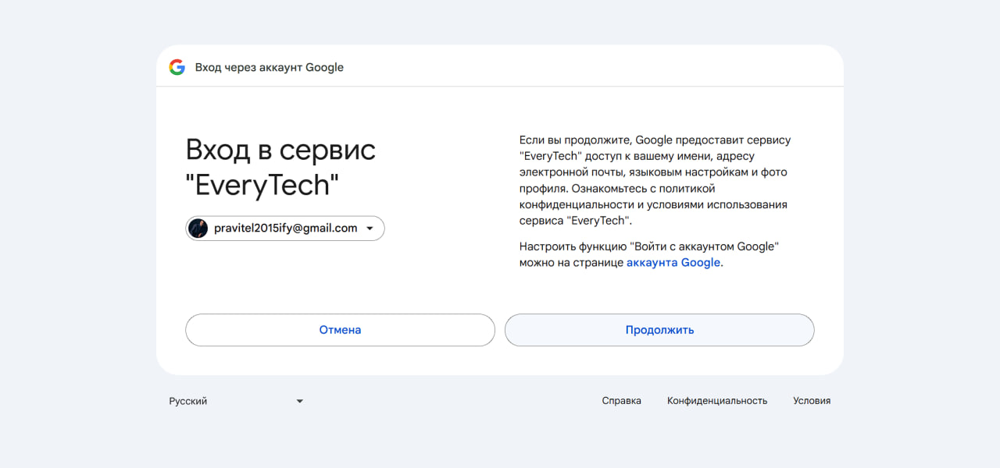
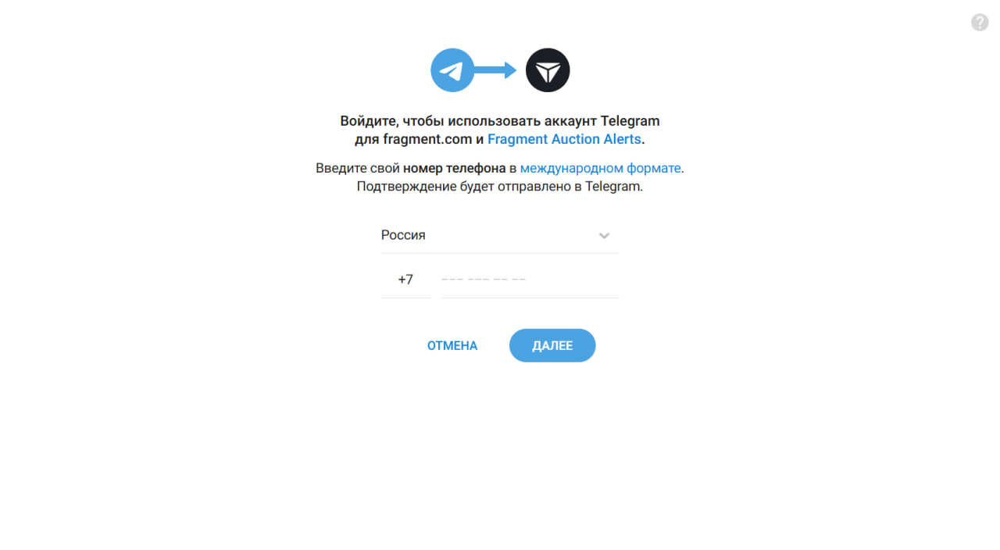
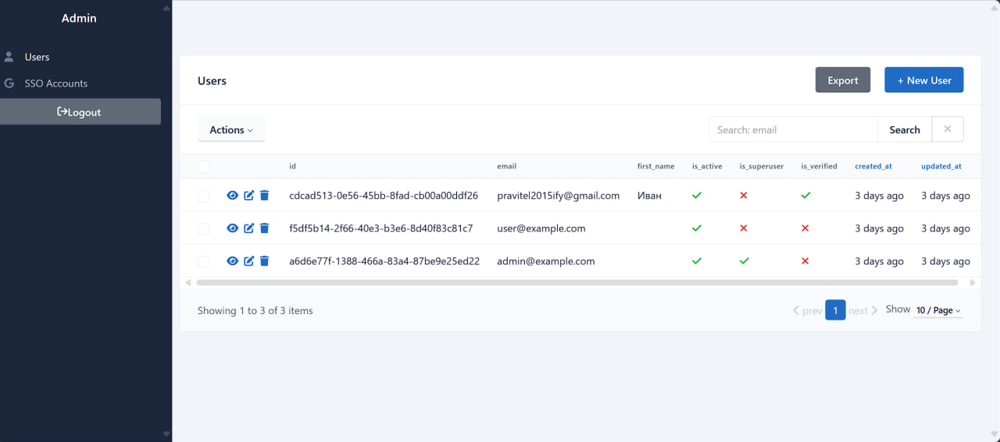
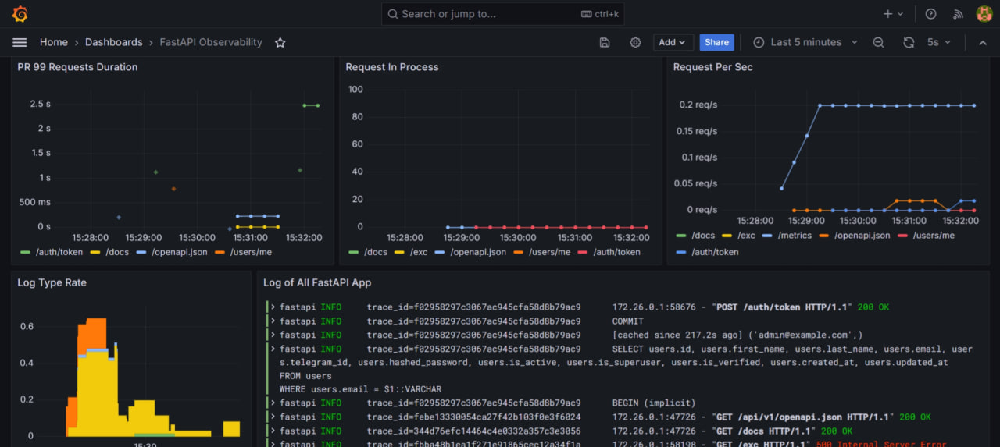

# Breeze Auth

Authorization server with OAuth2, roles, user management, etc.

## Features

- Secure and usable **JWT authorization**
- Extendable **single sign-on** via Google, Telegram & Yandex
- Confirm actions using a **one-time code** (Email & Telegram)
- Extendable **role-based access control**
- Powerful **user** management: CRUD, search, etc.
- **Admin panel** with authorization & CRUD operations
- **Observability** with Grafana: metrics, tracing & logging

## Installation

1. Install [observability preset](https://github.com/everysoftware/fastapi-obs)
2. Clone the repository:

    ```bash
    git clone https://github.com/everysoftware/fastapi-auth
    ```

3. Generate RSA keys:

    ```bash
    openssl genrsa -out certs/private.pem 2048
    openssl rsa -in certs/private.pem -pubout -out certs/public.pem
    ```

4. Create a `.env` file. Use the `.env.example` as a reference.
5. Run the application:

    ```bash
    make up
    ```

## Screenshots

### Swagger UI




### Consents





### Admin Panel



### Dashboards




**Made with ❤️**
